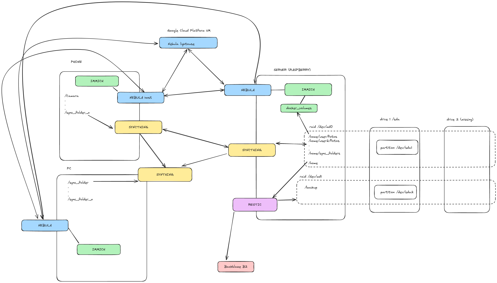

+++
title = 'This Was How I Replaced Google Drive With a Self Hosted System'
date = 2024-01-16T18:57:53-05:00
draft = true
+++

During a trip, i took photos, and those photos exceeded the limits of Google of storage. I am ok with paying for SaaS, but i dont like to pay for things i dont use. The pricing model of google is not that bad, but they use some hard limits, not what i use. I felt it like a waste of money. And the privacy issues with how they treat data historically was also a downer. 

For a while back i was pondering on the idea of selfhosting a solution, and along the way, i have been discovering some awesome technologies like nebula, syncthing, and more recently, immich and backup software like borg and restic. I also own a raspberry pi 4 with 8GB of RAM. 
At this moment i was on vacation so i decided to put the work and build my own cloud with backup there. I have researched nextcloud, almost went with openmediavault, but i finally decided with the next architecture. 

