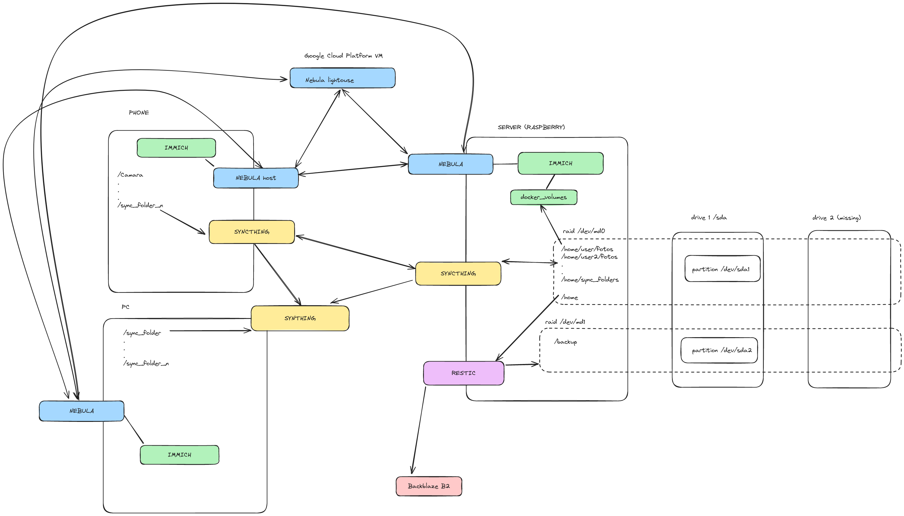

+++
title = 'This Was How I Replaced Google Drive With a Self Hosted System'
date = 2024-01-16T18:57:53-05:00
draft = false
+++

During a trip, i took photos, and those photos exceeded the storage limits of Google. I am ok with paying for SaaS, but i dont like to pay for things i dont use. The pricing model of google is not that bad, but they use some hard limits to charge you, instead of what you actually use. I felt it like a waste of money. And the privacy issues with how they treat data historically was also a downer. 

For a while back i was pondering on the idea of selfhosting a solution, and along the way, i have been discovering some awesome technologies like nebula, syncthing, and more recently, immich and backup software like borg and restic. I also own a raspberry pi 4 with 8GB of RAM. 
At this moment i was on vacation so i decided to put the work and build my own cloud with backup there. I have researched nextcloud, almost went with openmediavault, but i finally decided with the next architecture. 

The achitecture can be split in the following scopes:

1. Replication
2. Backup
3. Observability

## Replication

The first part of this began with where i would store the data. I used some spare hard drive disk i had. On the server, I initially created two raid with `mdadm` that replicated the data. 1 raid was for the actual data, and the other one was for the backup of said data. So in the case of one failing, i still have one spare, and my data would survive. 

[This was how i partitioned my hard drive]()

[This was how i created a degraded raid 1 for my only drive]()

[This was how i created users and a group in linux]()

For the second part, i needed to get the data in those drives. I mentioned openmediavault, but i felt it was a little overkill to what i needed, also just a wrapper around some well known technologies like mdadm, samba, or nfs. Then, I remembered, or stumble upon, syncthing again, and decided to go with it. Syncthing was in charge of taking my data from my devices and storing them in the server. The synced folder in the server had a policy of send/receive. and it is up to the clients to decide what they want to do with the folders synced. For the time being, i set them to just send, not receive. If i ever want to sync a folder completely in a client, i will make sure to be in the same physical network the server is. (Forgive the use of the terms client and server while talking about syncthing, i know is not correct, is the abstraction i created).

[This was how i installed syncthing and synchronize my photos]()

And this ends the part of replication of the system. 

## Observability

This whole endeavour started because of too many photos. I needed a way to explore my data on the server, that being photos, or any file. Honestly, i haven't really thought about any other data than photos so far. I think that is easy with samba, or ssh. But the photos was more challenging. Anyway, it was just a matter of setting up a service in the server, and expose it to the world to see (my world). 

The exposing part was made with nebula, for every service i enable in the server, i could create firewall rules to allow who could access what with their opened ports. I feel a little safer with it. There is a possibility i could do some port forwarding to bypass a vpn and use the internet directly, but i am not that certain about that. The extra step with nebula gives me a sense of security. 

[This was how i installed nebula]()

And the service i used to consume my photos was IMMICH. I dont let IMMICH to handle the upload, that is a syncthing job so far. IMMICH is for exploration and organization. 

[This was how i installed IMMICH server and app]()

Any other service would take a similar approach, opening a port in nebula for others to see, and clients consuming the service.

I have data, i have consumption, now i need

## Backup

This was the novelty of this project. I've never done anything like this before. I started with Borg, because it had a lot of followers, historically speaking. And i was planning to use rclone to save in the cloud my backups. 

[This was how i set up Borg]()

But after spending the time, i realized they didn´t recommend what i wanted to do, to copy the repo to the cloud. That is why i switched to restic

[This was how i changed borg to restic]()

With both a local backup and a cloud backup in Backblaze B2. The local backup is being saved in the /backup folder inside a raid. As an afterthought, maybe it was better to have the partitions separated and have 2 local backups in two different partitions. if a problem arise in a backup repo, it would be isolated to that repo only... Well... What is done is done. 

## Conclusion

Now I have a very young, self hosted, kind of a cloud system, with backup. I am sure is not a finished project, no project is. But it is at a point i can start testing it. I am afraid of losing my data. I have a contingency if a disk fail (raid), if some data is accidentally deleted (local backup), or if all my drives die (cloud backup). But if all of my drives die at the same time, and the backup gets corrupted too, that's the end. What are the odds of that? Murphy's law have no mercy. Places to go from here are spinnig up another cloud backup, and another drives backup, and some M-Disc Backup too with another backup system, like borg. 

But, will we ever be safe? 