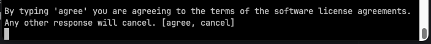
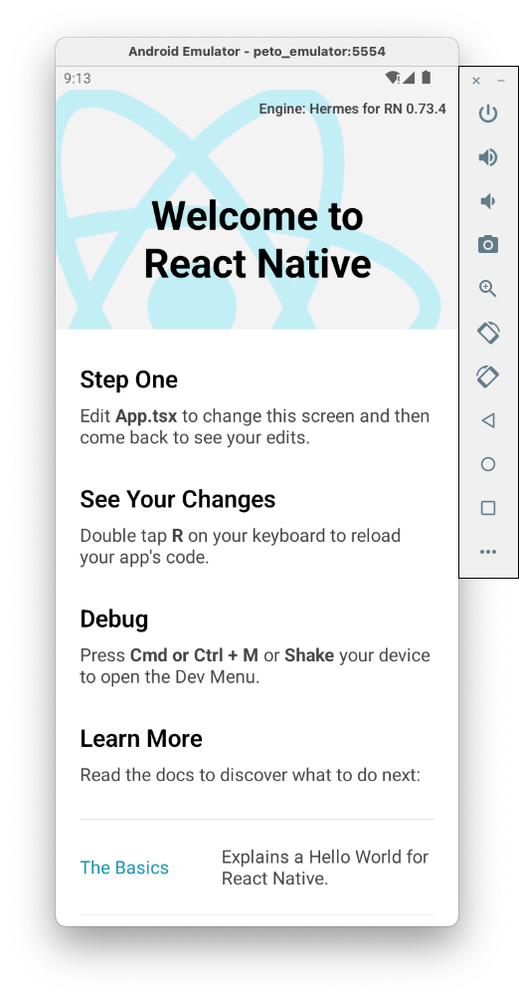

+++
title = 'This Was How I Setted Up A Workstation'
date = 2024-02-08T16:42:3-05:00
draft = true
+++

Llegar a un nuevo equipo de computo puede ser abrumador. Actualmente me dicen que es asi para mi trabajo (yo no lo comparto, pero ajá). Es desarrollo movil en react native. En una mac. Antes de chip intel. Al momento de escribir esto ahora tengo una mac con chip M1. Y como es una mac, se podran imaginar que los despliegues son tanto para android, como para iOS tambien. Yo admito que son un monton de cosas que hay que configurar. Pero no es el fin del mundo. Por ahora.

Entonces, como me acaba de llegar esta nueva mac, (y M1). Aprovechare para documentar de una vez el proceso que ha pasado por varias iteraciones: primero expo, luego el paso a paso con la guia de react native, luego tambien metiendo la de fastlane, luego sin android studio, luego con nix, luego con nix flakes, y ahora de nuevo con nix solo (viendo si le vuelvo a meter flakes). Este post va a ser denso. Tendre que escribir un poco sobre Nix, xcode, fastlane, certificados y perfiles, simuladores, android tools, emuladores, appcenter... etc, y el proyecto en sí de react native. Tal vez tengan razon en que es abrumador. Pero bueno, empecemos.

El nuevo equipo de computo es una mac modelo A2442, es pequeña, con un chip M1 y recien formateada. Lo primero que hice fue abrir safari para descargar firefox.

Tambien abri la terminal para instalar las herramientas para desarrolladores de linea de comandos con

```
xcode-select --install
```

Eso abre un cuadro de dialogo para instalar las herramientas.

### Instalar xcode

xcode es el editor integrado de desarrollo de apple y se puede conseguir gratis en la appstore en el siguiente enlace https://apps.apple.com/co/app/xcode/id497799835?mt=12. Solo se puede usar en macs y parece necesario para el desarrollo de aplicaciones moviles para iOS. Me pregunto que pasaría si no lo instalo, pero en este momento no quiero averiguar eso, así que lo instalo.
Igual es util cuando hay algun problema compilando para iOS, o creando esquemas, configuraciones, simuladores, mmmm, acabo de empezar a responder mi inquietud. Instalo xcode.

Al final de la instalación me encuentro con la sorpresa de que no puedo usar git ¿La razón? Tengo que aceptar una licencia de xcode :/ . hacerlo es tan facil como abrir xcode y aceptar, o correr el comando

```
sudo xcodebuild -license
```

y escribir agree



### Instalar nix

Usando el [el instalador de nix de Determinate Systems](https://github.com/DeterminateSystems/nix-installer) que es mas ergonomico de usar que el oficial, instalo nix con el comando.

```
curl --proto '=https' --tlsv1.2 -sSf -L https://install.determinate.systems/nix | sh -s -- install
```

Eso realizará una serie de pasos explicados uno a uno.

Mientras se instala, hablemos un poquito de nix https://nixos.org/. Nix es una herramienta con muchos propositos. Existe un sistema operativo NixOS; un repositorio de paquetes, nixpkgs; un administrador de dichos paquetes, un lenguaje de programación nix y tal vez algo mas que se me esté pasando. La gracia es que nix (en teoría) puede automatizar la obtención e instalación de paquetes, construcción de paquetes nuevos de mis desarrollos de software, y la creación de ambientes aislados, todo de manera reproducible, es decir, no importa en la maquina que estes, puedes acceder facilmente a todo lo que necesitas para trabajar en tu proyecto sin pasar de nuevo por la configuración del sistema y debería ser exactamente igual. Es un paradigma interesante. Te puede recordar a Docker, pero nix no trabaja con virtualización (aunque puedes crear una imagen de docker con nix, lo vi por ahi), y docker no trabaja con contenedores de mac con acceso a xcode sin tener que hacer una empanada (hack extremo). Nix, aunque teoreticamente puro, puede crear lo que llamo derivaciones impuras, que permiten acceder a xcode. Para mas información sobre nix, hay demasiada información dividida. Ese es el gran problema de nix, pero no me ha impedido usarlo.

#### Sobre el paradigma de nix

Uno de los últimos boom de nix han sido las flakes. La comunidad los ha adoptado bastante y es normal que algun proyecto nuevo empiece con ellas. Este proyecto no es uno de esos. Una de las razones por las que uso nix basico en lugar de flakes es porque quiero ser capaz de cambiar unas variables de entorno para que se vean reflejadas en el ambiente de desarrollo sin tener que agregarlas a git. Si no estan en git, los flakes no la ven :( . Si alguien sabe un modo de saltarse eso, me avisa. Otra es porque sigue siendo experimental a dia de hoy, aunque ya [mucha gente lo usa igual](https://determinate.systems/posts/experimental-does-not-mean-unstable)

Despues de instalar nix, lo uso para instalar la mayoria de paquetes que pueda con el y no tener un reguero (muchas opciones) de formas para instalar otras cosas, por uniformidad.

### Restaurar contraseñas

(Este punto es bastante personal por la manera que manejo mis contraseñas. Probablemente puedes saltarlo por completo). Instale gpg y de manera persistente para usarlo desde cualquier lugar como primer ciudadano del sistema. Por persistente quiero decir fijo en el sistema de la mac para que, cuando algun programa quiera usarlo, no tenga problemas accediendo a el. Esto lo hare con la [nueva cli de nix](https://nixos.org/manual/nix/stable/command-ref/new-cli/nix)

```
nix profile install nixpkgs#gnupg
```

Eso instalara gpg en el perfil por defecto de nix, lo cual es suficiente para mi. Todo lo que se instale en ese perfil estara disponible system-wide. Luego hago lo que escribi en [como guardo mis contraseñas]()

Con el repositorio de contraseñas en su lugar en el nuevo computador, ya soy libre para acceder y usar de todos los servicios para trabajar. Entrar a  google, atlassian, etc... y github, donde esta lo que es de interes: el proyecto de react native.

### Crear el ambiente de desarrollo

Me he tomado la molestia de crear un proyecto de cero para este instructivo. Esta en https://github.com/emmarq/Peto.

Luego de clonarlo, edito el archivo etc/nix/mac_environment.nix y coloco en la linea 5 la versión de xcode que tengo instalada. Puedo verla ejectutando xcodebuild -version

```
 version = "15.2"; # your xcode version
```

Tambien tengo que definir unas variables de entorno para poder usar las derivaciones privadas

```
export NIXPKGS_ACCEPT_ANDROID_SDK_LICENSE=1
export NIXPKGS_ALLOW_UNFREE=1
```

Ahora si navego al directorio del repo e inicio la shell de nix ejecutando el siguiente comando

```
nix-shell default.nix -A mac --impure
``` 

Para el caso de un computador con linux, el comando es:

```
nix-shell default.nix -A linux --impure
```

#### Actualizar dependecias de ruby o como arreglar el error de que no hay gemfile.lock

Me paso que fallo porque no existe el archivo Gemfile.lock. Tengo 2 maneras de solucionar este problema. 1. generar ese archivo que resulta luego de instalar las gemas de ruby, o 2. No necesitar ese archivo de alguna manera.

Ampliare un poco la situación con ruby. Cocoapods, que es el administrador de dependencias del proyecto de iOS, esta en ruby y fastlane tambien esta en ruby. Fastlane sugiere fuertemente que no se use la versión por defecto de la mac, entonces hay que instalar ruby por aparte. Las instalaciones de ruby han sido siempre un poco complicadas. Es algo que no entiendo el porqué, comparandolo con otros lenguajes. No puedo decir si ha mejorado con el tiempo porque ya estoy acostumbrado a su dificultad. En este caso, la instalación la hice con nix tambien; y las gemas, que son como programas de ruby (fastlane, cocoapods), tambien estan definidas con nix usando bundix. Bundix toma el gemfile y genera un gemset.nix con las derivaciones para instalar las gemas en el store de nix. Eso es un proceso que no es necesario que se conozca, a menos que haya que actualizar.

Despues de intentar ignorar el Gemfile.lock, bundlerEnv continuaba solicitando el dichoso archivo asi que a generarlo se dijo. Para generarlo inicie una nix shell distinta con:

```
nix-shell -p bundix
```

Dentro de la shell, ejecute bundix, que genera el gemfile.lock y el gemset.nix, movi el gemset.nix resultante a etc/nix, y me sali de la shell

```
bundix -l
mv gemset.nix etc/nix/
exit
```

Luego de estas divertidas aventuras con nix y ruby, reintento la ejecución del shell de nix original

#### Continuacion del ambiente

```
nix-shell default.nix -A mac --impure
``` 

Y voila! hizo algo bien que me dejo dentro de la shell de nix, pero todavia no canto victoria.

### Ejecución del proyecto en android

Ejecutare nuestro flamante peto en un emulador de android. Primero instalo las dependencias del proyecto en si con rmn. rmn es un alias que creé. Se puede ver en etc/nix/shellHook.nix que junta la instalacion de los paquetes de node y los pods.

Luego creo un android virtual device (avd)

Para linux y mac con chip intel

```sh
avdmanager create avd -n peto_emulator -k "system-images;android-33;google_apis_playstore;x86_64" -f -p android/avd
```

Para mac con arm chip

```sh
avdmanager create avd -n peto_emulator -k "system-images;android-33;google_apis;arm64-v8a" -p android/avd
```

Modifico el archivo de configuracion para habilitar el teclado y cambiar el tamaño del lcd del emulador con el script

```sh
etc/scripts/configure_avd.sh android/avd/config.ini
```

Arranco el emulador con el comando que tambien agrega la opción -dns-server 8.8.8.8 porque tuve un extraño problema de conectividad

```
nohup emulator -avd peto_emulator -dns-server 8.8.8.8 &
```

A continuación, se inicia el servidor de metro de react native
```
yarn start
```

Presiono la tecla a para instalar el app para android en el emulador. (El dispositivo que reconozca adb, en este caso, el emulador).

Y... me ha vuelto a fallar. Esta vez porque no tengo instaladas build tools para android 34. Es un error facil de corregir, solo es agregar lo que haga falta. El archivo que necesita los cambios es etc/nix/android_derivation.nix. En el encontramos una lista de dependencias para el desarrollo android como emulator, platform-tools, un android system image etc. Esas dependencias estan indexadas y al dia en el repositorio de github tadfisher/android-nixpkgs. Los nombres siguen una convención por lo que no es dificil encontrar paquetes en el repo en https://github.com/tadfisher/android-nixpkgs/tree/main/channels/stable. El ritmo de trabajo que sigo es intentar la compilación en android y, si falla por la ausencia de alguna dependencia, la agrego en etc/nix/android_derivation.nix, salgo, vuelvo a entrar a la shell de nix, y reintento la compilación. En este caso en particular empiezo por agregar platform-android-34 y build-tools-34-0-0 y reintento la compilación.

Success! La aplicación corre en el emulador, lista para empezar a ser desarrollada.


Para usar un android tangible solo es necesario conectarlo. Recomiendo hacerlo wireless para evitar problemas de drivers con el usb. De esta manera es tan sencillo como un adb pair 192.168.1.131 o un adb connect 192.168.1.131 (192.168.1.131 es la ip que tenía mi telefono en ese momento)

### Primera recapitulación

Para recapitular, para tener un ambiente de desarrollo de react native basico para android con nix se hacen los siguientes pasos

1. Instalar xcode https://apps.apple.com/co/app/xcode/id497799835?mt=12
2. Aceptar la licencia
```
sudo xcodebuild -license
```
3. Instalar nix
```
curl --proto '=https' --tlsv1.2 -sSf -L https://install.determinate.systems/nix | sh -s -- install
```
4. Definir estas variables de entorno
```
export NIXPKGS_ACCEPT_ANDROID_SDK_LICENSE=1
export NIXPKGS_ALLOW_UNFREE=1
```
5. Clonar el repositorio https://github.com/emmarq/Peto
Si se pretende usar otro repo, habría que hacer esto de mas
a. Copiar la carpeta etc y el archivo default.nix en el otro repo
b. Iniciar una shell con bundix
```
nix-shell -p bundix
```
Dentro de la shell, generar el archivo gemfile.lock y gemset.nix, y mover gemset.nix a etc/nix
``` 
bundix -l
mv gemset.nix etc/nix/
exit
```
6. Editar el archivo etc/nix/mac_environment.nix y colocar en la linea 5 la versión de xcode que esta instalada. Puede verse ejectutando xcodebuild -version
```
 version = "15.2"; # your xcode version
```
7. Iniciar la shell de nix (la primera vez es demorada, las otras veces algunos segundos)
```
nix-shell default.nix -A mac --impure
``` 
8. Instalar las dependencias de node y cocoapods
```
npm install && cd ios && pod install && cd ..
```
9. Crear un emulador
```
avdmanager create avd -n peto_emulator -k "system-images;android-33;google_apis;arm64-v8a" -p android/avd
```
10. Configurar el emulador creado
```
etc/scripts/configure_avd.sh android/avd/config.ini
```
11. Iniciar el emulador
```
nohup emulator -avd peto_emulator -dns-server 8.8.8.8 &
```
12. Iniciar metro y correr en android (presiona a)
```
npm start
```
